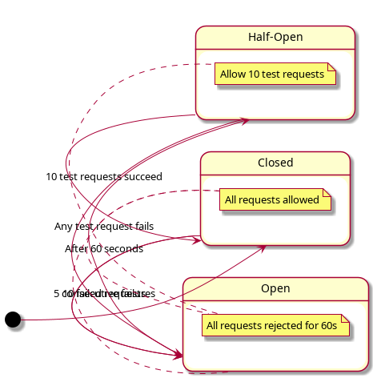
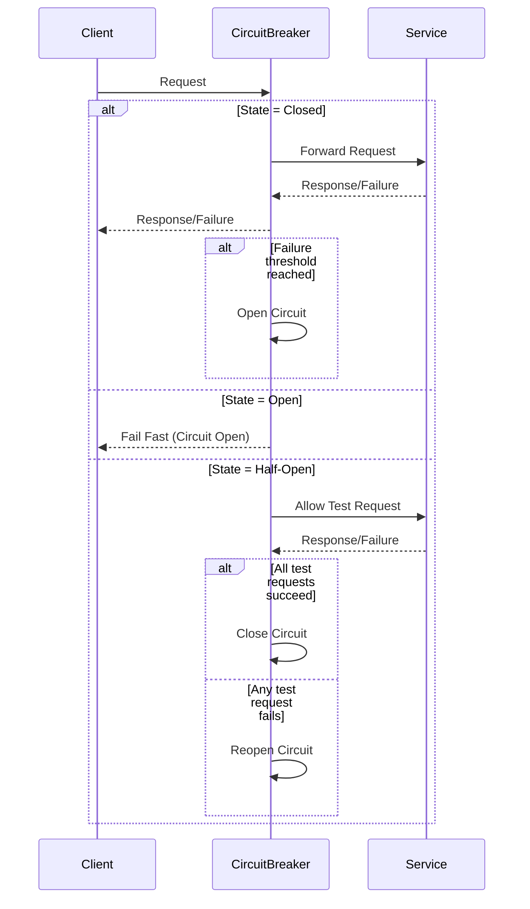

# High-Level Design Document: Circuit Breaker

## 1. Overview

The Circuit Breaker is a resilience pattern designed to prevent an application from repeatedly trying to execute an operation that is likely to fail, thereby allowing it to fail fast and recover gracefully. This design aims to protect downstream services and maintain system stability under failure conditions.

## 2. Goals & Non-Functional Requirements

- **Fault Rate Control:** Ensure the rate of faults remains below a defined threshold.
- **Failure Counting:** Track the number of failed requests.
- **Trip Threshold:** Trip (open) the circuit after 5 consecutive failures.
- **Open State Duration:** Keep the circuit open (tripped) for 60 seconds before attempting to reset.
- **Trip Request Count:** Trip the circuit after 10 failed requests (if not already tripped by consecutive failures).
- **Reset Request Count:** Allow 10 requests in half-open state to determine if the circuit can be closed (reset).
- **Library Evaluation:** Consider using established libraries such as Resilience4j, Polly, or Hystrix.

## 3. Architecture

### 3.1. States

- **Closed:** All requests are allowed. Failures are counted.
- **Open:** All requests are rejected immediately for a fixed period (60 seconds).
- **Half-Open:** A limited number of requests (10) are allowed to test if the underlying service has recovered.

### 3.2. State Transitions

- **Closed → Open:** When 5 consecutive failures or 10 failed requests occur.
- **Open → Half-Open:** After 60 seconds, allow 10 test requests.
- **Half-Open → Closed:** If all 10 test requests succeed.
- **Half-Open → Open:** If any of the 10 test requests fail.

### 3.3. Main Components

- **Failure Counter:** Tracks consecutive and total failures.
- **Timer:** Manages the open state duration.
- **Request Filter:** Allows or blocks requests based on the current state.
- **State Manager:** Handles transitions between Closed, Open, and Half-Open states.
- **Metrics & Logging:** Records state changes, failures, and recovery attempts.

## 4. State Diagram

## 5. Sequence Diagram

## 6. Technology Considerations

- **Language:** (To be determined by implementation context)
- **Open-Source Libraries:** Evaluate Resilience4j (Java), Polly (.NET), Hystrix (Java, legacy).
- **Metrics:** Integrate with monitoring tools for observability.

## 7. Assumptions

- The circuit breaker is stateless per request, but stateful per service instance.
- Failure is defined as an exception or timeout from the downstream service.
- The system clock is reliable for timer management.

## 8. Open Questions

- What constitutes a "failure" (HTTP 5xx, timeouts, etc.)?
- Should the thresholds be configurable at runtime?
- How will the circuit breaker state be shared in a distributed environment?

---

**Next Steps:**
- Finalize technology stack and library selection.
- Define detailed API and integration points.
- Implement and test the circuit breaker logic. 