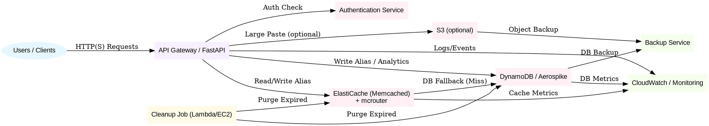

# TinyURL System Design & Algorithm

## 1. Overview
The TinyURL service is a highly available, read-heavy system for shortening URLs, supporting billions of records and high QPS. The design leverages NoSQL (e.g., Aerospike), external caching (e.g., Memcached with mcrouter), and AWS services for scalability and reliability.

---

## 2. URL Shortening Algorithm
### a. Requirements
- Each user should get a unique short URL for the same original URL (no deduplication across users).
- Handle URL-encoded variations (e.g., `https://a.com/x%20y` vs `https://a.com/x y`).
- Prevent collisions and ensure uniqueness.

### b. Hashing & Uniqueness
- **Hash Input:** Concatenate `user_id` (or `api_dev_key`) + canonicalized original URL (decode, normalize, sort query params) + optional sequence number (for custom aliases or retries).
- **Hash Algorithm:** Use a strong, fast hash (e.g., SHA-256, then base62 encode first N bits for short code).
- **Collision Handling:**
  - On collision, append/increment a sequence number and re-hash.
  - Store mapping: `{user_id, original_url, [sequence]} → alias`.
- **Custom Alias:** If provided, check for uniqueness per user.

### c. URL Canonicalization
- Decode URL-encoded parts.
- Normalize (lowercase host, remove default ports, sort query params).
- This ensures different encodings of the same URL by the same user map to the same canonical form.

---

## 3. Concurrency & Partitioning
- **Concurrency:**
  - Use atomic upserts in the database (e.g., Aerospike's `put` with existence check).
  - For custom aliases, enforce uniqueness with atomic operations.
- **Partitioning:**
  - Partition/shard by hash(alias) or user_id for even distribution.
  - Use AWS DynamoDB partition keys or Aerospike set/namespace sharding.

---

## 4. Caching Layer
- **Cache:** Memcached (with mcrouter for horizontal scaling and routing).
- **Cache Policy:**
  - Cache 20% of daily traffic (from capacity estimates: 19,290 QPS read × 0.2 × 86,400 sec ≈ 333 million requests/day; 20% ≈ 66 million hot URLs).
  - Each object ≈ 500 bytes → 66M × 500B ≈ 33 GB cache memory needed.
- **Cache Strategy:**
  - Externalize cache (not in-app memory).
  - Lazy loading: Only update cache on miss (read-through).
  - Use LRU eviction.
  - Use mcrouter to distribute cache load.

---

## 5. Purging & Cleanup
- **Default Expiration:** 2 years for each link.
- **Automatic Removal:** Remove links not accessed for 6 months (background job scans `last_accessed`).
- **TTL:** Set at DB and cache level.
- **Cleanup:**
  - Periodic background job scans for expired or unused links and deletes them.
  - Use DynamoDB TTL or Aerospike's native TTL.

---

## 6. AWS Service Mapping
- **API Layer:** AWS API Gateway + AWS Lambda (or EC2/ECS for FastAPI/Uvicorn)
- **Database:** Amazon DynamoDB (or self-managed Aerospike on EC2)
- **Cache:** Amazon ElastiCache for Memcached
- **Object Storage (optional):** Amazon S3 (for large payloads)
- **Monitoring:** Amazon CloudWatch
- **Backup:** DynamoDB/Aerospike backup tools, S3 for snapshots

---

## 7. System Design DOT Diagram

---

## 8. Summary
- Unique short URLs per user, even for the same original URL.
- Canonicalization and user/sequence in hash input for uniqueness.
- Partitioning and atomic DB ops for concurrency.
- External cache sized for 20% of daily traffic (≈33 GB).
- Lazy cache loading, LRU eviction, mcrouter for scale.
- Default 2-year expiration, auto-removal after 6 months inactivity.
- AWS-native or self-managed options for all components. 